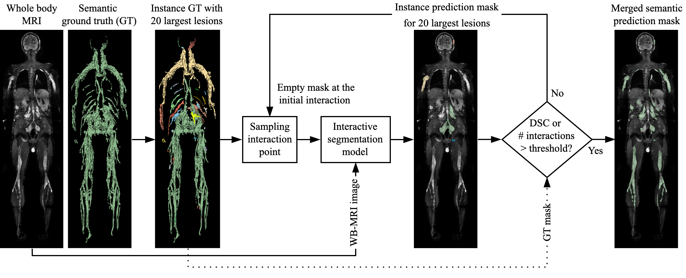
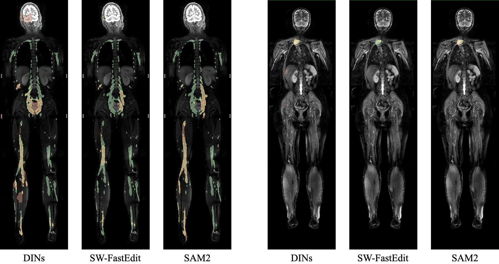

# Neurofibroma Interactive Segmentation Benchmarking

**Official Implementation of**: *Transformers or Convolutions? Benchmarking Models for Interactive Segmentation of Neurofibromas in Whole-Body MRI*

**Authors:** Georgii Kolokolnikov, Marie-Lena Schmalhofer, Lennart Well, Inka Ristow, and René Werner  
University Medical Center Hamburg-Eppendorf, 20246 Hamburg, Germany

The paper has been submitted to the **Artificial Intelligence in Medicine (AIME) 2025** short-paper track: [AIME 2025 Conference](https://aime25.aimedicine.info/)

---

## Overview

### Evaluation Pipeline for Interactive Segmentation Models

The repository benchmarks various **convolution-** and **transformer-based** interactive segmentation models on whole-body MRI data of **Neurofibromatosis Type 1 (NF1)** patients.

We introduce a unified **evaluation pipeline** that enables automated assessment of interactive segmentation models under two interaction scenarios:

1. **Lesion-wise Interaction:**
   - A subset of **20 largest lesions** is selected.
   - Each lesion is refined separately using model predictions.
   - Interactions continue until a threshold **per-lesion Dice Similarity Coefficient (DSC)** is reached or the **maximum number of interactions per lesion** is exhausted.

2. **Global Scan-wise Interaction:**
   - The entire scan is refined iteratively.
   - Each correction targets the **largest segmentation error**.
   - The model is evaluated based on its ability to improve segmentation accuracy globally.

Below is an illustration of the **lesion-wise interaction scenario:**




### Evaluated Models

This repository evaluates and benchmarks the following interactive segmentation models:

- **[DINs (Deep Interactive Networks)](https://github.com/Jarvis73/DINs/tree/main)** - CNN-based model incorporating user feedback.
- **[SW-FastEdit (Sliding Window FastEdit)](https://github.com/Zrrr1997/SW-FastEdit)** - CNN-based model leveraging a sliding window strategy.
- **[SimpleClick](https://github.com/uncbiag/SimpleClick/tree/v1.0) + [STCN](https://github.com/uncbiag/iSegFormer/tree/v2.0/maskprop/Med-STCN) (STILL UNDER DEVELOPMENT)** - Transformer-based interactive segmentation model operating in 2D + segmentation propagation model.
- **[SAM2 (Segment Anything Model 2)](https://github.com/facebookresearch/sam2/tree/main)** - Transformer-based model extending 2D segmentation into videos. We applied its frame-wise processing to slices of 3D whole-body MRI along the anterior-posterior axis.

The figure below presents examples of neurofibroma segmentation predicted by different fine-tuned models in a **lesion-wise interaction scenario** (3 interactions per 20 largest lesions) on two cases:
- Left three images → High tumor burden case
- Right three images → Low tumor burden case



Color coding for segmentation performance:
- True Positives → Yellow
- False Positives → Red
- False Negatives → Green

---

## Setup and Installation

### Clone the Repository
```bash
git clone https://github.com/IPMI-ICNS-UKE/NFInteractiveSegmentationBenchmarking.git
cd NFInteractiveSegmentationBenchmarking
```

<details> <summary>Click here to see an overview of the repository structure</summary>
  <pre><code>
.
├── data
│   ├── processed
│   │   └── README.MD
│   ├── raw
│   │   └── README.MD
│   └── splits
│       ├── fold_1
│       │   ├── train_set.txt
│       │   └── val_set.txt
│       └── ...
├── data_scripts
│   ├── convert_3d_mri_to_2d_slices.py
│   ├── split_into_train_val_sets.py
│   └── checking_data.ipynb
├── environment_tf.yml
├── environment_torch.yml
├── evaluation
│   ├── experiment_launchers
│   ├── results
│   ├── README.MD
│   └── ...
├── experiments
├── launchers
│   ├── finetune_dins.sh
│   ├── finetune_sam2.sh
│   ├── finetune_simpleclick.sh
│   ├── finetune_stcn.sh
│   ├── finetune_sw_fastedit.sh
│   └── ...
├── model_code
│   ├── DINs_Neurofibroma
│   ├── iSegFormer_Neurofibroma
│   ├── SimpleClick_Neurofibroma
│   ├── sam2_Neurofibroma
│   └── SW_FastEdit_Neurofibroma
├── model_weights
│   ├── convert_tf_to_onnx.py
│   ├── export_sam2_model_weights.py
│   └── README.MD
├── model_weights_finetuned
│   ├── test_onnxruntime.py
│   └── README.MD
├── results
│   ├── result_analysis.ipynb
│   └── illustration_generation.ipynb
├── README.md
└── ...
  </code></pre>
</details>


### Environment Setup
There are two environments:
1. **PyTorch-based** (for evaluation pipeline and training of most models, including SAM2, SimpleClick, and SW-FastEdit)
2. **TensorFlow-based** (for training and model weights exporting of DINs)

#### PyTorch Environment
```bash
conda env create -f environment_torch.yml
conda activate nf_iseg_benchmark_torch
```
Then install **SAM2**:
```bash
cd model_code/sam2_Neurofibroma
pip install -e .
pip install -e ".[dev]"
```
Install additional packages:
```bash
pip install git+https://github.com/cheind/py-thin-plate-spline
```

#### TensorFlow Environment (for DINs training and exporting only)
```bash
conda env create -f environment_tf.yml
conda activate nf_iseg_benchmark_tf
pip install git+https://github.com/IDSIA/sacred.git@0.8.3
```

---

## Usage

### Data Preparation

The repository was developed for and tested with **3D whole-body MRI** scans in `.nii.gz` format. Potentially, it can also work with other 3D data in .nii.gz format, however some adjustments could be required.

1. Place the original dataset in `data/raw/`, following the structure:
   - `imagesTr/`
   - `labelsTr_instance/`
   - `imagesTs/`
   - `labelsTs_instance/`

   Refer to `data/raw/README.md` for further details.

2. Since transformer-based models were originally designed for 2D images, 3D images need to be sliced using:
   ```bash
   python data_scripts/convert_3d_mri_to_2d_slices.py
   ```

3. To split data into training and validation sets:
   ```bash
   python data_scripts/split_into_train_val_sets.py
   ```

### Getting Pre-Trained Model Weights

Pre-trained models should be downloaded and placed in `model_weights/` following the structure in `model_weights/README.md`.
Download links:

- **DINs**: [DINs Repository](https://github.com/Jarvis73/DINs/tree/main?tab=readme-ov-file#32-testing)
- **SW-FastEdit**: [SW-FastEdit Repository](https://github.com/Zrrr1997/SW-FastEdit?tab=readme-ov-file#evaluation-on-autopet-ii)
- **SimpleClick + STCN**:
  - [SimpleClick](https://github.com/uncbiag/SimpleClick/tree/v1.0?tab=readme-ov-file#download)
  - [STCN](https://github.com/uncbiag/iSegFormer/tree/v1.0?tab=readme-ov-file#evaluation)
- **SAM2 (SAM2.1 Hiera Base Plus)**: [SAM2 Repository](https://github.com/facebookresearch/sam2/tree/main?tab=readme-ov-file#getting-started)

### Model Training & Fine-Tuning

Once pre-trained weights and data are set up, models can be trained/fine-tuned using the **bash scripts in `launchers/`**.

Training/Fine-Tuning Scripts:
```bash
bash launchers/finetune_dins.sh
bash launchers/finetune_sam2.sh
bash launchers/train_sw_fastedit.sh
```

The progress, log files, and artifacts generated during training are dumped to `experiments/`.

**In case of the DINs model**, use the following script to export it from TensorFlow to ONNX (requires the TensorFlow environment `nf_iseg_benchmark_tf`):
```bash
python model_weights/convert_tf_onnx.py
```

**In case of the SAM2 model**, please export the model weights from the checkpoint:
```bash
python model_weights/export_sam2_model_weights.py
```

Once a model is trained, the final model weights should be placed to `model_weights_finetuned/`, according to `model_weights_finetuned/README.md`.

### Model Evaluation

To evaluate trained models, navigate to `evaluation/experiment_launchers/` and execute the respective bash scripts inside, for example:
```bash
cd evaluation/experiment_launchers
bash launch_SAM2_lesion_wise_corrective.sh
```

The evaluation results (metrics, predictions) are saved in `evaluation/results/`.

### Analyze Evaluation Results
Results can be analyzed using Jupyter notebooks in `results/`:
```bash
cd results
jupyter notebook result_analysis.ipynb
```

---

## Tested Configuration
**Data**: Highly anisotropic T2-weighted fat-suppressed coronal WB-MRI (3T) with voxel spacing of 0.625 mm x 0.625 mm x 7.8 mm in NIFTI format acquired with Siemens Magnetom scanner (Siemens Healthineers, Erlangen, Germany).

**Hardware**: 
- Machine 1: 64-bit Ubuntu 22.04.5 LTS with an AMD Ryzen Threadripper Pro 3975WX CPU and an NVIDIA RTX A6000 GPU
- Machine 2: 64-bit Ubuntu 22.04.4 LTS with an AMD Ryzen 9 7950X3D CPU and an NVIDIA GeForce RTX 4090 GPU

---

## Notes and Disclaimer
- Ensure all **paths are correctly configured** according to your local setup.
- This repository was tested with **3D whole-body MRI (.nii.gz)** images. Other 3D medical imaging data may require spatial adjustments.
- Any **modifications to training configurations** can be made in the **bash scripts inside `launchers/`**.
- Any **modifications to evaluation configurations** can be made in the **bash scripts inside `evaluation/experiment_launchers`**.

---
## Acknowledgement

We would like to thank all the authors of the following repositories and respective research papers that were instrumental in our work:
- [DINs: Deep Interactive Networks for Neurofibroma Segmentation in Neurofibromatosis Type 1 on Whole-Body MRI](https://github.com/Jarvis73/DINs/tree/main); Zhang et al. (2022), [IEEE Journal of Biomedical and Health Informatics](https://doi.org/10.1109/JBHI.2021.3087735)
- [Sliding Window Fastedit: A Framework for Lesion Annotation in Whole-Body Pet Images](https://github.com/Zrrr1997/SW-FastEdit); Hadlich et al. (2024), [IEEE ISBI](https://doi.org/10.1109/ISBI56570.2024.10635459)
- [SimpleClick: Interactive Image Segmentation with Simple Vision Transformers](https://github.com/uncbiag/SimpleClick/tree/v1.0); Liu et al. (2023), [ICCV](https://doi.org/10.1109/ICCV.2023.22290)
- [Exploring Cycle Consistency Learning in Interactive Volume Segmentation](https://github.com/uncbiag/iSegFormer/tree/v2.0); Liu et al. (2023), [arXiv preprint](https://arxiv.org/abs/2303.06493)
- [SAM 2: Segment Anything in Images and Videos](https://github.com/facebookresearch/sam2/tree/main); Ravi et al. (2024), [arXiv preprint](https://arxiv.org/abs/2408.00714)

---

## Contact
For questions, feedback, or collaboration inquiries, please contact:
- [Georgii Kolokolnikov](mailto:g.kolokolnikov@uke.de)
- [Institute for Applied Medical Informatics](https://www.uke.de/english/departments-institutes/institutes/applied-medical-informatics/index.html)

For technical issues or feature requests, please open an issue in this repository’s [Issues section](https://github.com/IPMI-ICNS-UKE/NFSegmentationPipeline/issues).
